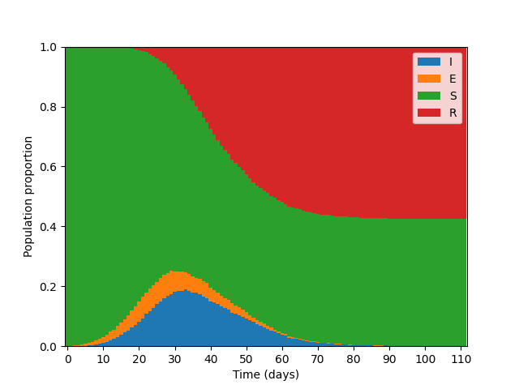
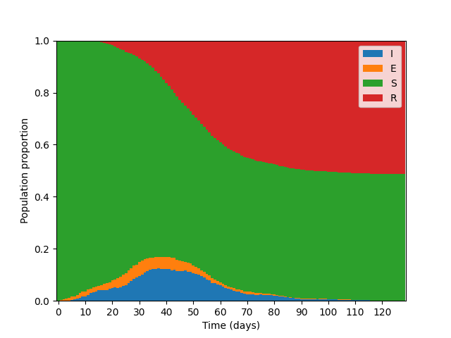

# Open SEIR Graph: A project investigating population structure interventions on epidemic dynamics

## Introduction

This open project is inspired by the Covid-19 epidemic of 2020, with the aim of studying the
effect of underlying social structure on epidemic dynamics. The project intends to model
the effect of various social structure interventions (lockdowns, quarantines, isolation, social-distancing)
on the dynamics of disease spread. 

The basic model for this study is an SEIR model [SEIR (Susceptible, Exposed, Infectious,Removed)](https://en.wikipedia.org/wiki/Compartmental_models_in_epidemiology#Elaborations_on_the_basic_SIR_model) 
built on a graphical population structure. A graph is used to represent a population with each
node representing a person, and edges representing social contacts between two people.
Interventions are understood as dynamic updates to the underlying structure.
The current model is built in python using the `networkx` python package to graph structure.
We encourage collaborators of all kinds to use this repository to study different interventions,
and to improve the realism of the SEIR model.

We shall consider two primary outcomes of interest: The peak proportion of the population infected and the duration for which the proportion
of the infected population exceeds some threshold (say 10%). Technical details regarding the model can be found in `Papers/Model_details.pdf`. This pdf
documents also defines estimands of interest and discusses methods for obtaining
Monte Carlo estimates of these quantities. 

## Illustrative Example

As an example of the effect of population structure we consider two populations, of 5000
people, the first of which is generated according to the [Barabási–Albert (BA)](https://en.wikipedia.org/wiki/Barab%C3%A1si%E2%80%93Albert_model)
preferential attachent model, the second generated according to a [Power law cluster (PLC)](https://journals.aps.org/pre/abstract/10.1103/PhysRevE.65.026107)
model. The PLC graph grows according to preferential attachment, but has an additional 
step which makes clique formation more likely.

These two graph types were chosen as they reasonably replicate the scale free behaviour observed in naturally occuring
social structures, with the second also replicating clique-like behaviour. The source code for this example is found in 
`example_plots.py`. Epidemics were set up with a single intial infectious person (patient 0).

For this illustration, an incubation period of 4 days after exposure was assumed, during which the probability of transmission to a susceptible person along an edge
was 0.01. This was followed by an infectious period of 10 days during which the probability of transmission along an edge
was 0.05 per day. Two realisations of such a epidemic on the BA and PLC graphs are shown by the two figures below.
Both graphs contained 9996 edges (social connections).

To investigate the effect of this structural difference on the maximum proportions of infections
a Monte Carlo simulation can be run, the code for which can be found in `Monte_Carlo_estimator.py`.
For this particular example, across 100 MC simulations from each model we approximate the expected 
maximum infection proportion to be 0.254±0.001 and 0.195±0.001, suggesting that greater clustering of
the social contact graph may significantly reduce the peak number of infections during the epidemic.

## Future work

At this stage this project is very much in its infancy, however collaborators may 
direct future work to the following areas:
* How can the SEIR model be modified to more accurately reflect transmission observations
observed in practice. This may include adding additional strucutre to reflect age and comorbidities.
* What graphical structure best represents that of real social contact? To what extent
are conclusions about intervention measures sensitive to the underlying graphical strucutre?
* What is the effect of dynamic interventions? These may include adding additional rules
such as removing edges from infecting individuals (e.g. quarantine), removing edges from certian 
individuals for a limited number of days (e.g. lockdown, social-distancing)

